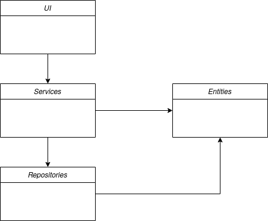
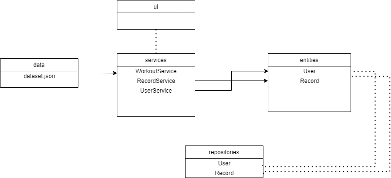

# Arkkitehtuurikuvaus

## Rakenne

Ohjelman rakenne noudattelee kolmitasoista kerrosarkkitehtuuria:

Pakkaus _ui_ sisältää käyttöliittymästä, _services_ sovelluslogiikasta, _entities_ sovelluksen käyttämiä tietokohdeluokeista ja _repositories_ tietojen pysyväistallennuksesta vastaavan koodin.

## Sovelluslogiikka

Sovelluksen loogisen tietomallin muodostavat luokat [User](https://github.com/IlmastMaksim/ot-harjoitustyo/blob/master/src/entities/user.py) ja [Record](https://github.com/IlmastMaksim/ot-harjoitustyo/blob/master/src/entities/record.py), jotka kuvaavat käyttäjiä ja suorittamaa harjoitusta. 

Toiminnallisista kokonaisuuksista vastavat luokat WorkoutService ja RecordService. Luokat tarjoavat kaikille käyttäliittymän toiminnoille omat metodit mm:

#### WorkoutService

- `get_criterias_by_name(name)`
- `get_composed_workout(equipment, exercise_type, muscle_group)`
- `get_example_link_by_exercise(exercise)`

#### RecordService

- `count_workouts_per_day()`
- `count_times_exercises_done()`
- `save_workout(exercise, sets, reps)`

WorkoutService käyttää [tietojoukkoa](https://github.com/IlmastMaksim/ot-harjoitustyo/blob/master/src/data/dataset.json) jotta tarjota tiedot harjoituksista. Sovelluksen osien suhdetta kuvaava luokka/pakkauskaavio:

