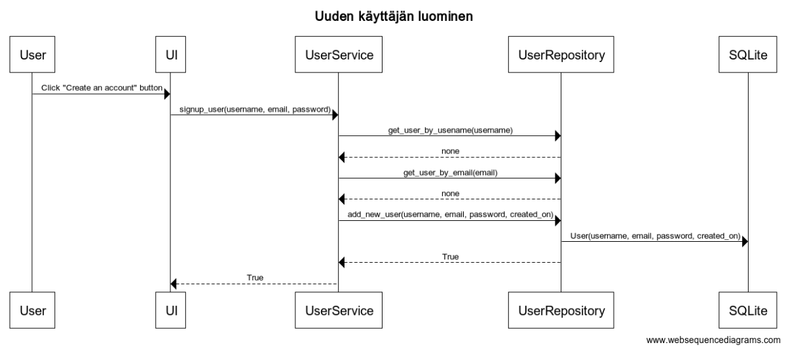

# Arkkitehtuurikuvaus

## Rakenne

Ohjelman rakenne noudattelee kolmitasoista kerrosarkkitehtuuria:

Pakkaus _ui_ sisältää käyttöliittymästä, _services_ sovelluslogiikasta, _entities_ sovelluksen käyttämiä tietokohdeluokeista ja _repositories_ tietojen pysyväistallennuksesta vastaavan koodin.

## Käyttöliittymä 

Käyttöliittymä sisältää kolme erillistä näkymää:

- Kirjautuminen/rekisteröinti
- Harjoittelun luominen/Harjoittelun tulosten tallentaminen
- Tulosten esitys taulokon ja kaavioiden muodossa

## Sovelluslogiikka

Sovelluksen loogisen tietomallin muodostavat luokat [User](https://github.com/IlmastMaksim/ot-harjoitustyo/blob/master/src/entities/user.py) ja [Record](https://github.com/IlmastMaksim/ot-harjoitustyo/blob/master/src/entities/record.py), jotka kuvaavat käyttäjiä ja suorittamaa harjoitusta. 

Toiminnallisista kokonaisuuksista vastavat luokat WorkoutService ja RecordService. Luokat tarjoavat kaikille käyttäliittymän toiminnoille omat metodit mm:

#### WorkoutService

- `get_criterias_by_name(name)`
- `get_composed_workout(equipment, exercise_type, muscle_group)`
- `get_example_link_by_exercise(exercise)`

#### RecordService

- `count_workouts_per_day()`
- `count_times_exercises_done()`
- `save_workout(exercise, sets, reps)`

WorkoutService käyttää [tietojoukkoa](https://github.com/IlmastMaksim/ot-harjoitustyo/blob/master/src/data/dataset.json) jotta tarjota tiedot harjoituksista. Sovelluksen osien suhdetta kuvaava luokka/pakkauskaavio:

## Tietojen pysyväistallennus

Pakkauksen repositories luokat RecordRepository ja UserRepository huolehtivat tietojen tallettamisesta. RecordRepository käsittelee suoritettuja harjoitteluja, samalla kuin UserRepository huolehtii käyttäjän luomista ja kirjautumista. Molemmat käyttävät SQLite-tietokantaa.

## Tietojoukon lähteet

Sovelluksessa käytetään tietojoukkoa `dataset.json` ja siinä oleva data alkuperäisesti tulee [avoimesta lähteestä](https://airtable.com/shrKZ9lPpw7EvjZ3X/tblvscpkbagqlWKkH).

## Päätoiminnallisuudet

### Uuden käyttäjän luominen

Käyttäjä voi luoda uusi käyttäjätunnus klikkammalla nappiin "Create an account" ja syöttämällä tiedot tulevasta tunnuksesta UI-osalla. Sitten tapahtumakäsittelijä kutsuu sovelluslogiikan metodia `signup_user()` antaen parametriksi luotavan käyttäjän tiedot mm. käyttäjätunnus, sähköposti ja salasana. Sovelluslogiikka selvittää UserRepository:n avulla onko käyttäjätunnus olemassa. Jos ei, eli uuden käyttäjän luominen on mahdollista, luo sovelluslogiikka User-olion ja tallettaa sen kutsumalla UserRepository:n metodia `add_new_user()`. Tästä seurauksena on se, että käyttöliittymä vaihtaa näkymäksi Login:n.

### Käyttäjän kirjautuminen

Käyttäjä voi kirjautua sisään syöttämällä tiedot omasta käyttäjätunnuksestaan. Sitten tapahtumakäsittelijä kutsuu sovelluslogiikan metodia `login_user()` antaen parametriksi kirjautuvan käyttäjän tiedot mm. käyttäjätunnus ja salasana. Sovelluslogiikka selvittää UserRepository:n avulla onko käyttäjätunnus olemassa. Jos on, niin sovelluslogiikka tarkistaa onko syötty salasana oikein. Jos on, niin se hyväksyy kirjautumisyrityksen ja vaihtaa käyttöliittymää näkymäksi Workout-tabin.

### Harjoituksen luominen

Käyttäjä voi luoda uusi harjoittelu valitsemalla mitkä kriteriat siihen kuuluuvat. Sitten tapahtumakäsittelijä kutsuu sovelluslogiikan metodia `get_composed_wokrout()` antaen parametriksi harjoitukseen kuuluuvien kriterein tiedot mm. harjoituksessa käyttävät varusteet, harjoituksen tyypi ja lihasryhmät, joihin keskeytetään. Tällöin sovelluslogiikka, omasta puolestansa, säveltää harjoittelun kritterein pohjalla ottaen huomioon parametrit ja palauttaa harjoittelun tuloksena. Tästä seuraa että näkymä muuttuu sellaiseksi ikkunaksi, jossa sävelty harjoittelu on esitetty interaktiivisen taulukon muodossa. 

### Harjoituksen tallentaminen

Käyttäjä voi tallentaa suoritetun harjoituksen painaamalla Save-nappin. Sitten tapahtumakäsittelijä kutsuu sovelluslogiikan metodia `save_workout()` kaikille suoritetuille harjoituksille antaen parametriksi mm. harjoituksen nimi, sarjojen määrä, toistojen määrä ja käyttäjänimi.Tällöin sovelluslogiikka luo Record-olion ja tallettaa sen kutsumalla RecordRepository:n metodia `save_workout_as_record()`. Vihdoin käyttöliittymää muuttuu näkymäksi Workout-tabin.

### Tulosten esitys taulokon ja kaavioiden muodossa

Käyttäjä voi nähdä suorituksia analysoituina ja esitettyinä taulokon ja kaavioiden muodossa valitsemalla "records"-tabiin. Sitten tapahtumakäsittelijä kutsuu sovelluslogiikan metodeja `get_all_records_by_user()`, `count_times_exercises_done()`, `count_times_exercises_done_by_user()`, `count_workouts_per_day()`, `count_workouts_per_day_by_user()`, jotta saada tarvittavan datan esittämiseen. Lopuksi, käyttäjän pitää pystyä näkemään taulukkoa suorituksia sekä erilaisia, asiaankuuluvia kaavioita.

## Ohjelman rakenteeseen jääneet heikkoudet

### Käytettävyys

Tällä hetkellä, tiedon tallentaessa "records"-tabissa olevia UI-alkioita eivät reagoi datan päivitykseen automattisesti, mikä voisi olla korjaattu.

### Käyttöliittymä

DearPyGui ei tukee gif-kuvia, siis esimerkkikuva jää liikkumatta, kuitenkin tämän ominsaisuuden voidaan lisätä tulevissa versioissa.

### Muut toiminnallisuudet

Olisi järkevä vielä lisätä mahdollisuus asettaa muistutukset harjoituksista.