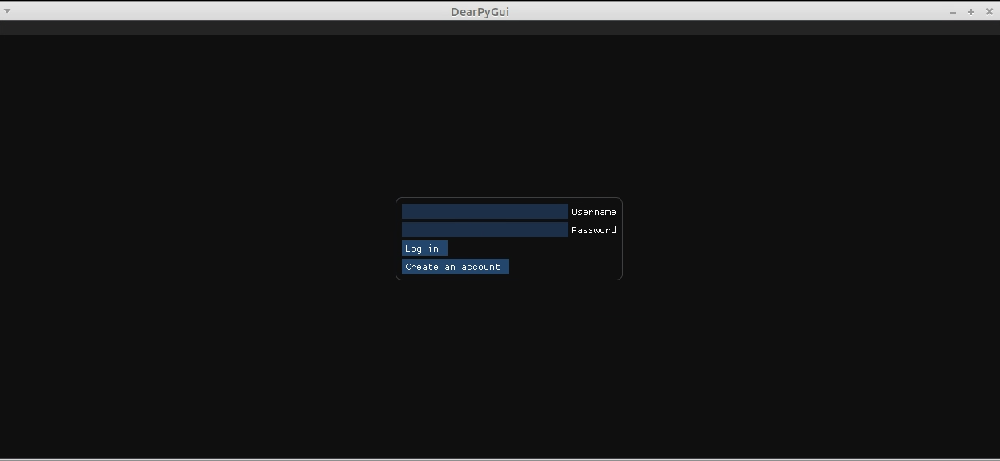
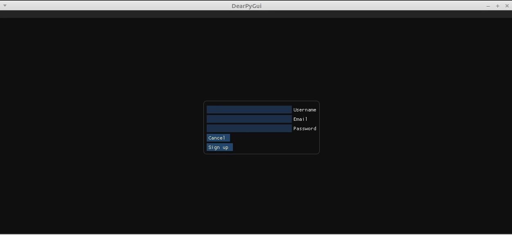
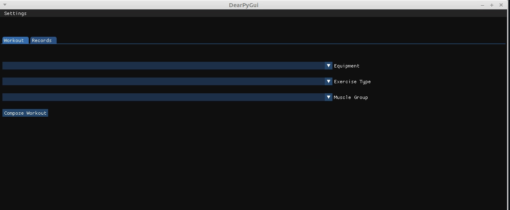
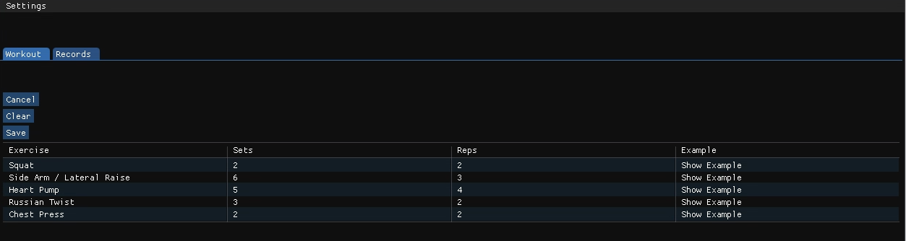
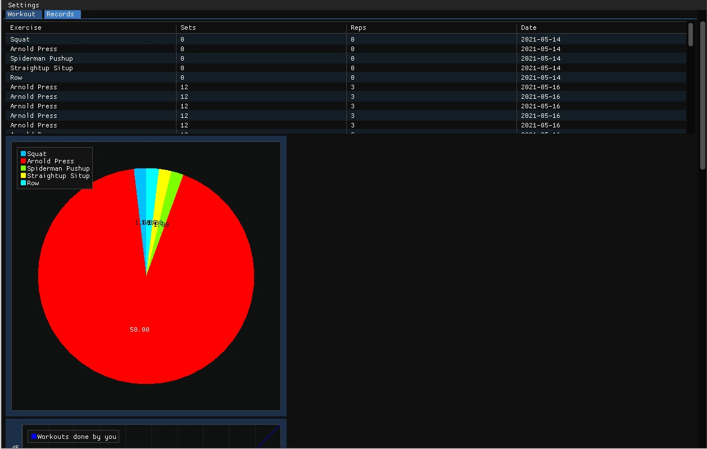

# Käyttöohje

Lataa projektin viimeisimmän [releasen](https://github.com/IlmastMaksim/ot-harjoitustyo/releases) lähdekoodi valitsemalla _Assets_-osion alta _Source code_.

## Konfigurointi
Luo .env-tiedosto projektin juurihakemistoon ja kirjoita sinne seuraavat ympäristömuuttujat:

| Avainsana | Arvo |
| ------ | ------ |
| DATABASE_FILE  | database.sqlite |
| DATASET_FILE | dataset.json |
| EXAMPLE_IMAGE_FILE | temp.gif |

## Ohjelman käynnistäminen

Ennen ohjelman käynnistämistä, asenna riippuvuudet komennolla:

```bash
poetry install
```

Jonka jälkeen suorita alustustoimenpiteet komennolla:

```bash
poetry run invoke build
```

Nyt ohjelman voi käynnistää komennolla:

```
poetry run invoke start
```

## Alustus

Sovellus käynnistyy kirjautumisnäkymään:



## Uuden käyttäjän luominen

Kirjautumisnäkymästä on mahdollista siirtyä uuden käyttäjän luomisnäkymään panikkeella "Create an account".

Uusi käyttäjä luodaan syöttämällä tiedot syötekenttiin ja painamalla "Signup"-painiketta:



## Kirjautuminen

Jos käyttäjän luominen onnistuu, voidaan kirjautua sisään antaen tiedot käyttäjästä, joka on olemassa.

## Harjoituksen luominen

Onnistuneen kirjautumisen myötä siirrytään harjoituksen luomisen näkymään:



Siinä voidaan luoda uusi harjoittelu valitsemalla mitkä kriteriat siihen kuuluuvat.


## Harjoituksen tallentaminen

Onnistuneen harjoitelun suorittamisen myötä siirrytään harjoituksen tallentamisen näkymään:



Siinä voidaan tallentaa suoritetun harjoitelun painaamalla Save-nappin. 


## Tulosten esitys taulokon ja kaavioiden muodossa

Suorituksia voi nähdä analysoituina ja esitettyinä taulokon ja kaavioiden muodossa:

