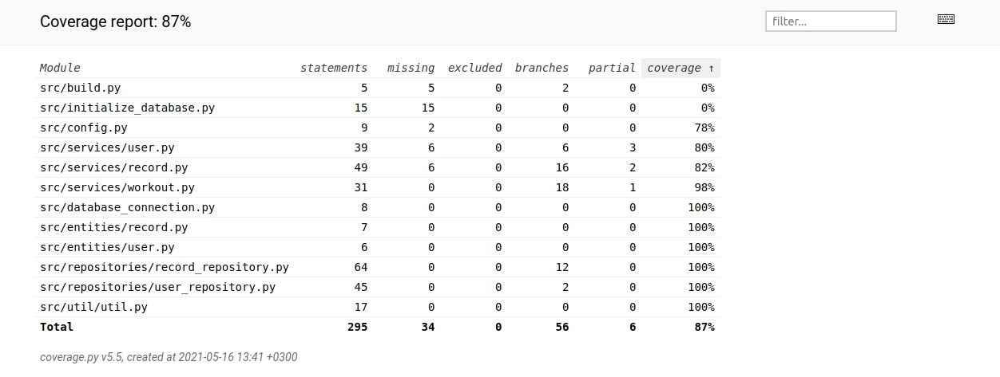

# Testausdokumentti

Ohjelmaa on testattu sekä automatisoiduin yksikkö- ja integraatiotestein unittestilla sekä manuaalisesti tapahtunein järjestelmätason testein.

## Yksikkö- ja integraatiotestaus

### Sovelluslogiikka

Sovelluslogiikasta vastaavia luokia `RecordService`, `UserService` ja `WorkoutService` testataan käyttäen testiluokia `RecordServiceTest`, `UserServiceTest` ja `WorkoutServiceTest` vastaavasti. 

### Repositorio-luokat

UserRepository-luokkaa testataan UserRepoTest-testiluokalla ja RecordRepository-luokkaa RecordRepoTest-testiluokalla.

### Testauskattavuus

Käyttöliittymäkerrosta lukuunottamatta sovelluksen testauksen haarautumakattavuus on 87%.

## Järjestelmätestaus

Sovelluksen järjestelmätestaus on suoritettu manuaalisesti.

### Asennus ja konfigurointi

Sovellusta on testattu [käyttöohjeen](./kayttoohje.md) kuvaamalla tavalla sekä Windows- että Linux-ympäristössä.

Sovellusta on testattu sekä tilanteissa, joissa käyttäjät ja osakkeet tallettavat tietokannat ovat olleet olemassa ja joissa niitä ei ole ollut jolloin ohjelma on luonut ne itse.

### Toiminnallisuudet

Kaikki [määrittelydokumentin](./vaatimusmaarittely.md) ja käyttöohjeen listaamat toiminnallisuudet on käyty läpi. Kaikkien toiminnallisuuksien yhteydessä on syötekentät yritetty täyttää myös virheellisillä arvoilla kuten tyhjillä.

## Sovellukseen jääneet laatuongelmat

Sovellus ei anna tällä hetkellä järkeviä virheilmoituksia, seuraavissa tilanteissa:

- Konfiguraation määrittelemiin tiedostoihin ei ole luku/kirjoitusoikeuksia
- SQLite tietokantaa ei ole alustettu, eli `python -m poetry run invoke build`-komentoa ei ole suoritettu